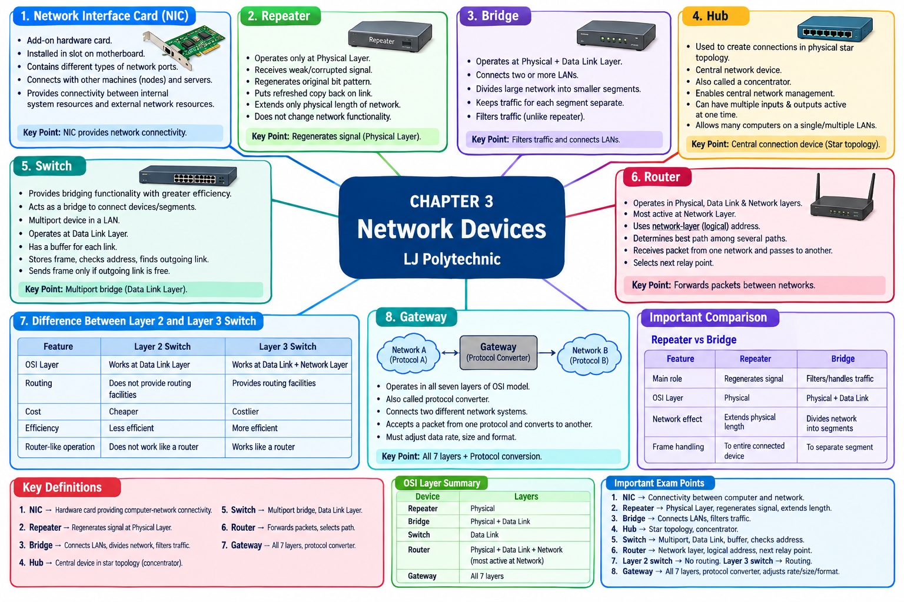

# LJ-DCN-sem3-chapter3-explained

---

# DCN — Chapter 3: Network Devices

I checked the uploaded PPT and its slide content first. The chapter contains **9 slides** and covers these network devices/topics:

1. Network Interface Card (NIC)
    
2. Repeater
    
3. Bridge
    
4. Hub
    
5. Switch
    
6. Router
    
7. Difference between Layer 2 and Layer 3 Switches
    
8. Gateway
    

The explanation below follows the PPT's order and terminology.

---

# STEP 1 — DEEP EXPLANATION

## 1. Network Interface Card (NIC)

### Definition

A **Network Interface Card (NIC)** is an additional hardware card installed on the motherboard of a computer to provide network connectivity.

The PPT describes a NIC as a small printed circuit board installed in the motherboard of the CPU. It provides connectivity between the computer's internal system resources and external resources connected to the network.

### Main Points

According to the PPT:

- NIC is an **add-on hardware card**.
    
- It is installed physically into a **slot on the motherboard**.
    
- It contains different types of **network ports**.
    
- These ports allow communication with:
    
    - Other machines/nodes
        
    - Servers
        
- NIC provides connectivity between:
    
    - Internal computer system resources
        
    - External network resources.
        

### Simple Understanding

Think of the NIC as the **connection interface between a computer and a network**.

```text
        COMPUTER
   ┌─────────────────┐
   │ CPU / Memory    │
   │ Internal System │
   └────────┬────────┘
            │
            │ NIC
            ▼
     ┌──────────────┐
     │ Network      │
     │ Interface    │
     │ Card         │
     └──────┬───────┘
            │
            ▼
       NETWORK
     ┌──────┴──────┐
     │             │
   Other PC      Server
```

### Example

Suppose a desktop computer needs to communicate with a server on a LAN. The NIC provides the hardware interface through which the computer connects to that network.

### ⭐ Exam Point

**NIC is a hardware card that provides connectivity between a computer and the network.**

---

# 2. Repeater

## Definition

A **Repeater** is an electronic network device that operates only at the **Physical Layer of the OSI model**.

### Why is a Repeater Needed?

A signal carrying information can travel only a certain distance through a network.

As the signal travels:

```text
Strong Signal
     │
     ▼
─────────────── Network Link ───────────────►
                                             │
                                             ▼
                                        Weak/Corrupted
                                           Signal
```

Noise can affect the integrity of the data when the signal becomes weak.

A repeater is placed before the signal becomes too weak or corrupted.

### Working of Repeater

The PPT explains the process as:

```text
Original Signal
      │
      ▼
Network Link
      │
      ▼
Weak/Corrupted Signal
      │
      ▼
   REPEATER
      │
      │ Regenerates original
      │ bit pattern
      ▼
Refreshed Signal
      │
      ▼
Extended Network Link
```

The repeater:

1. Receives the signal.
    
2. Receives it before it becomes too weak/corrupted.
    
3. Regenerates the original bit pattern.
    
4. Places a refreshed copy back onto the link.
    

### Important Limitation

A repeater extends **only the physical length** of a network.

It does **not change the functionality of the network**.

### ⭐ Exam Points

- Repeater → **Physical Layer**
    
- Regenerates signal.
    
- Helps overcome signal weakening.
    
- Extends physical network length.
    
- Does not change network functionality.
    

---

# 3. Bridge

## Definition

A **Bridge** is a network device that operates at both the **Physical Layer and Data Link Layer** of the OSI model.

### Main Functions

A bridge:

- Connects **two or more LANs**.
    
- Divides a large network into smaller segments.
    
- Keeps traffic for different segments separate.
    
- Filters traffic.
    

### Simple Diagram

```text
             Large Network
                  │
        ┌─────────┴─────────┐
        │      BRIDGE       │
        └─────────┬─────────┘
                  │
          ┌───────┴───────┐
          │               │
        LAN 1            LAN 2
      Segment 1        Segment 2
```

### Traffic Filtering

One of the important differences given in the PPT is how repeaters and bridges handle frames.

A repeater retransmits frames to the entire connected device.

A bridge transmits frames only to the appropriate separate segment. Therefore, the bridge can **filter/handle traffic**.

### Example

Imagine a network divided into two LAN segments:

```text
LAN A ───── Bridge ───── LAN B
```

If traffic belongs to LAN B, the bridge can forward it toward LAN B instead of unnecessarily sending it throughout LAN A.

### ⭐ Exam Points

- Bridge → **Physical + Data Link Layer**
    
- Connects two or more LANs.
    
- Divides a large network into smaller segments.
    
- Filters traffic.
    
- Keeps traffic for segments separate.
    

---

# 4. Hub

## Definition

A **Hub** is a central network device used to create connections between stations in a **physical star topology**.

A hub is also called a **concentrator**.

### Hub as Central Device

In a physical star topology, all connected computers are connected to the central hub.

```text
              Computer 1
                  │
                  │
Computer 2 ──── HUB ──── Computer 3
                  │
                  │
              Computer 4
```

The hub acts as the central connection point.

### Main Points from PPT

The hub:

- Creates connections between stations.
    
- Is used in physical star topology.
    
- Is a central network device.
    
- Is also called a **concentrator**.
    
- Enables central network management.
    
- Can have multiple inputs and outputs active at one time.
    
- Allows a large number of computers to be connected to a single or multiple LANs.
    

### Example

In a small computer lab, several computers can be physically connected to a central hub.

```text
PC1 ─┐
PC2 ─┤
PC3 ─┼── HUB
PC4 ─┤
PC5 ─┘
```

### ⭐ Exam Points

Remember:

> **Hub = Central connection device + Star topology + Concentrator**

---

# 5. Switch

## Definition

A **Switch** provides bridging functionality with greater efficiency.

It acts as a bridge to connect devices or network segments and is a **multiport device in a LAN**.

### Layer

According to the PPT:

**Switch operates in the Data Link Layer of the OSI model.**

### Buffer

A switch has a **buffer for each link** to which it is connected.

When a switch receives a frame:

1. It receives the frame.
    
2. Stores it in the buffer of the receiving link.
    
3. Checks the address.
    
4. Finds the appropriate outgoing link.
    
5. If the outgoing link is free, it sends the frame through that particular link.
    

### Working

```text
             PC 1
              │
              │
              ▼
          ┌─────────┐
PC 2 ────►│ SWITCH  │────► PC 4
          └─────────┘
              │
              ▼
             PC 3
```

Suppose PC1 wants to send a frame to PC4.

```text
PC1
 │
 ▼
SWITCH
 │
 │ Checks address
 │
 ▼
Correct outgoing link
 │
 ▼
PC4
```

The switch does not simply treat every destination in the same way; it checks the address and selects the outgoing link.

### ⭐ Exam Points

- Switch provides **bridging functionality with greater efficiency**.
    
- It is a **multiport** device.
    
- Operates at **Data Link Layer** according to the PPT.
    
- Has a buffer for each link.
    
- Checks the address to determine the outgoing link.
    

---

# 6. Router

## Definition

A **Router** is a network device that operates in the **Physical, Data Link, and Network Layers** of the OSI model. It is most active in the **Network Layer**.

### Logical Address

Routers can access the **network-layer address**, also called a **logical address**, of a device.

The router uses software to determine which of several available paths is best for a particular transmission.

### Basic Function

The simplest function of a router is:

> Receive a packet from one connected network and pass it to another connected network.

### Router Diagram

```text
          Network A
              │
              │
              ▼
        ┌───────────┐
        │  ROUTER   │
        └─────┬─────┘
              │
       Selects next
       relay point
              │
              ▼
          Network B
```

A router can have several connected networks:

```text
                 Network A
                     │
                     │
                     ▼
                ┌────────┐
Network B ─────►│ ROUTER │─────► Network C
                └────────┘
                     │
                     ▼
                 Network D
```

The router determines which connected network is the best **next relay point** for a packet.

### Example

Suppose a packet has to travel from Network A to Network C.

```text
Network A
    │
    ▼
 Router
    │
    ├── Network B
    │
    └── Network C  ← selected path
```

The router chooses the appropriate next network.

### ⭐ Exam Points

- Router works across **Physical, Data Link and Network Layers** according to the PPT.
    
- Most active at **Network Layer**.
    
- Uses **logical/network-layer addresses**.
    
- Determines an appropriate path.
    
- Transfers packets between connected networks.
    

---

# 7. Difference Between Layer 2 Switch and Layer 3 Switch

This is an important comparison directly provided in the PPT.

|Point|Layer 2 Switch|Layer 3 Switch|
|---|---|---|
|OSI Layer|Works at **Data Link Layer**|Works at **Data Link + Network Layer**|
|Routing|Does **not** provide routing facilities|Provides routing facilities|
|Cost|Cheaper compared to Layer 3 switch|Costlier compared to Layer 2 switch|
|Efficiency|Less efficient|More efficient|
|Router-like operation|Does not work like a router|Works like a router|

### Easy Memory Trick

```text
Layer 2 Switch
      ↓
Data Link
      ↓
No Routing

Layer 3 Switch
      ↓
Data Link + Network
      ↓
Routing
      ↓
Works like Router
```

### ⭐ Very Important Exam Point

The most important difference is:

**Layer 2 switch → Data Link Layer → No routing**

**Layer 3 switch → Data Link + Network Layer → Routing**

---

# 8. Gateway

## Definition

A **Gateway** operates in **all seven layers of the OSI model**.

A gateway is also called a **Protocol Converter**.

### Main Function

A gateway is used to connect **two different network systems**.

It can accept a packet formatted according to one protocol and convert it into a packet formatted according to another protocol before forwarding it.

### Basic Working

```text
Network System A
   Protocol A
       │
       ▼
   ┌─────────┐
   │ GATEWAY │
   │Protocol  │
   │Converter │
   └────┬────┘
        │
        ▼
Network System B
   Protocol B
```

### Protocol Conversion

```text
Protocol A
    │
    ▼
 Gateway
    │
    ├── Adjust data rate
    ├── Adjust size
    └── Adjust format
    │
    ▼
Protocol B
```

The PPT specifically states that the gateway must adjust:

- **Data rate**
    
- **Size**
    
- **Format**
    

It converts the protocol from one network to another.

### Example

Suppose two different network systems use different communication protocols.

```text
Network A
Protocol A
    │
    ▼
 GATEWAY
    │
    │ Conversion
    ▼
Network B
Protocol B
```

The gateway performs the required protocol conversion so the two different network systems can communicate.

### ⭐ Exam Points

- Gateway → **All 7 OSI layers**
    
- Also called **Protocol Converter**
    
- Connects different network systems.
    
- Converts one protocol into another.
    
- Adjusts data rate, size and format.
    

---

# IMPORTANT COMPARISON: REPEATER vs BRIDGE

The PPT specifically contrasts their frame handling.

|Feature|Repeater|Bridge|
|---|---|---|
|Main role|Regenerates signal|Filters/handles traffic|
|OSI operation in PPT|Physical Layer|Physical + Data Link|
|Network effect|Extends physical length|Divides network into segments|
|Frame handling|Retransmits to entire connected device|Transmits to appropriate separate segment|

### Memory Trick

```text
REPEATER → Refresh Signal

BRIDGE → Filter Traffic
```

---

# QUICK OSI-LAYER REVISION

Based on the PPT:

```text
                 OSI LAYERS

Layer 7 ─┐
Layer 6  │
Layer 5  │
Layer 4  │
Layer 3 ─┼── Router
         │
Layer 2 ─┼── Bridge
         │   Switch
         │
Layer 1 ─┼── Repeater
         │
         └── Hub / NIC-related physical connectivity
```

**Important:** The PPT explicitly states:

- Repeater → Physical Layer
    
- Bridge → Physical + Data Link
    
- Switch → Data Link
    
- Router → Physical + Data Link + Network, most active at Network
    
- Gateway → All seven layers.
    

---

# CHAPTER SUMMARY

**Network devices** are hardware/network components used to provide connectivity, extend networks, connect LANs, manage traffic, forward packets, or convert protocols.

### Main devices covered:

|Device|Key Function|
|---|---|
|**NIC**|Provides computer-to-network connectivity|
|**Repeater**|Regenerates weak/corrupted signals|
|**Bridge**|Connects LANs and filters traffic|
|**Hub**|Central connection device in physical star topology|
|**Switch**|Efficient multiport bridging in a LAN|
|**Router**|Forwards packets between networks and selects paths|
|**Layer 2 Switch**|Data Link operation without routing|
|**Layer 3 Switch**|Data Link + Network operation with routing|
|**Gateway**|Connects different network systems and converts protocols|

---

# IMPORTANT DEFINITIONS

1. **NIC:** An add-on hardware card installed on the motherboard that provides connectivity between the computer and external network resources.
    
2. **Repeater:** An electronic device operating at the Physical Layer that regenerates a signal and places a refreshed copy back onto the network link.
    
3. **Bridge:** A device operating at the Physical and Data Link Layers that connects LANs, divides networks into segments and filters traffic.
    
4. **Hub:** A central network device used to connect stations in a physical star topology; also called a concentrator.
    
5. **Switch:** A multiport LAN device providing bridging functionality with greater efficiency.
    
6. **Router:** A device that forwards packets between connected networks and determines an appropriate next relay point.
    
7. **Gateway:** A device operating across all seven OSI layers that connects different network systems and converts protocols.
    

---

# IMPORTANT DIFFERENCES

### Repeater vs Bridge

**Repeater**

- Physical Layer
    
- Regenerates signal
    
- Extends physical network length
    

**Bridge**

- Physical + Data Link
    
- Filters traffic
    
- Divides network into segments
    

### Layer 2 vs Layer 3 Switch

**Layer 2**

- Data Link Layer
    
- No routing
    
- Cheaper
    
- Does not work like router
    

**Layer 3**

- Data Link + Network Layer
    
- Provides routing
    
- Costlier
    
- Works like router
    

---

# IMPORTANT EXAM POINTS ⭐

### Must Remember

1. **NIC → Connectivity between computer and network**
    
2. **Repeater → Physical Layer**
    
3. **Repeater → Regenerates signal**
    
4. **Repeater → Extends physical length**
    
5. **Bridge → Physical + Data Link**
    
6. **Bridge → Connects LANs**
    
7. **Bridge → Filters traffic**
    
8. **Hub → Physical star topology**
    
9. **Hub → Concentrator**
    
10. **Switch → Data Link Layer**
    
11. **Switch → Multiport bridging**
    
12. **Switch → Uses buffers for links**
    
13. **Router → Most active at Network Layer**
    
14. **Router → Uses logical/network-layer address**
    
15. **Router → Determines next relay point**
    
16. **Layer 2 switch → No routing**
    
17. **Layer 3 switch → Routing**
    
18. **Layer 3 switch → Works like a router**
    
19. **Gateway → All 7 OSI layers**
    
20. **Gateway → Protocol Converter**
    
21. **Gateway → Adjusts data rate, size and format**
    

---

## 📌 PPT Coverage Check for STEP 1

|PPT Topic|Covered|
|---|--:|
|Network Devices / Introduction|✅|
|Network Interface Card (NIC)|✅|
|Repeater|✅|
|Bridge|✅|
|Hub|✅|
|Switch|✅|
|Router|✅|
|Layer 2 vs Layer 3 Switch|✅|
|Gateway|✅|
|Definitions|✅|
|PPT comparisons|✅|
|PPT important points|✅|

**Step 1 completed.**

The uploaded PPT refers to figures for some devices, but the supplied slides do not contain separate visible diagram objects for those references; therefore, I have **not invented a supposed original PPT diagram**. I used clear explanatory ASCII diagrams instead.

### Next section: **STEP 2 — Complete Text Mind Map**

When you say **`next`**, I will continue directly with the complete text-based mind map.

---



Yes 👍 **Text-based mind map is here.** The previous response had it, but I’ll keep it clearly separated so you can use it directly for revision.

# STEP 2 — COMPLETE TEXT-BASED MIND MAP

```text
                         CHAPTER 3
                      NETWORK DEVICES
                            │
        ┌───────────────────┼────────────────────┐
        │                   │                    │
        ▼                   ▼                    ▼
   1. NIC              2. REPEATER          3. BRIDGE
        │                   │                    │
        ├─ Add-on card      ├─ Electronic       ├─ Physical Layer
        │  hardware         │  device           ├─ Data Link Layer
        ├─ Motherboard      ├─ Physical Layer   ├─ Connects 2 or
        │  slot             ├─ Receives weak    │  more LANs
        ├─ Network ports    │  signal           ├─ Divides large
        ├─ Connects with    ├─ Regenerates      │  network into
        │  nodes            │  bit pattern      │  segments
        ├─ Connects with    ├─ Refreshes        ├─ Keeps traffic
        │  servers          │  signal           │  separate
        └─ Computer ↔       ├─ Extends physical ├─ Filters traffic
           Network          │  network length   └─ Handles frames
                            └─ Does not change
                               functionality


        ┌───────────────────┼────────────────────┐
        │                   │                    │
        ▼                   ▼                    ▼
    4. HUB              5. SWITCH             6. ROUTER
        │                   │                    │
        ├─ Physical Star    ├─ Bridging          ├─ Physical Layer
        │  Topology         │  functionality     ├─ Data Link Layer
        ├─ Central device   ├─ Greater           ├─ Network Layer
        ├─ Connects nodes   │  efficiency        ├─ Most active at
        ├─ Concentrator     ├─ Multiport LAN     │  Network Layer
        ├─ Central network  ├─ Data Link Layer   ├─ Uses logical
        │  management       ├─ Buffer for each   │  address
        ├─ Multiple inputs  │  link              ├─ Determines best
        │  & outputs        ├─ Receives frame     │  path
        └─ Connects many    ├─ Stores in buffer  ├─ Receives packet
           computers        ├─ Checks address    │  from one network
                            ├─ Finds outgoing    ├─ Sends to another
                            │  link              └─ Finds next
                            └─ Sends if link         relay point
                               is free


                     ┌──────────────────────┐
                     │ 7. LAYER 2 vs LAYER 3│
                     │       SWITCHES       │
                     └──────────┬───────────┘
                                │
                ┌───────────────┴───────────────┐
                │                               │
                ▼                               ▼
         LAYER 2 SWITCH                  LAYER 3 SWITCH
                │                               │
                ├─ Data Link Layer              ├─ Data Link Layer
                ├─ No routing                   ├─ Network Layer
                ├─ Cheaper                      ├─ Routing facilities
                ├─ Less efficient               ├─ Costlier
                └─ Not like router              ├─ More efficient
                                                └─ Works like router


                            │
                            ▼
                     8. GATEWAY
                            │
                            ├─ All 7 OSI Layers
                            ├─ Protocol Converter
                            ├─ Connects different
                            │  network systems
                            ├─ Accepts one protocol
                            ├─ Converts to another
                            ├─ Forwards packet
                            └─ Adjusts
                               ├─ Data rate
                               ├─ Size
                               └─ Format


                    IMPORTANT COMPARISON
                            │
                ┌───────────┴───────────┐
                │                       │
                ▼                       ▼
           REPEATER                  BRIDGE
                │                       │
                ├─ Regenerates          ├─ Filters traffic
                │  signal               ├─ Connects LANs
                ├─ Physical Layer       ├─ Physical +
                └─ Extends physical     │  Data Link
                   length               └─ Divides network
                                          into segments


                     OSI LAYER REVISION
                            │
        ┌───────────────────┼────────────────────┐
        │                   │                    │
        ▼                   ▼                    ▼
    REPEATER             BRIDGE               SWITCH
        │                   │                    │
   Physical           Physical +           Data Link
                      Data Link
        │                   │
        └──────────┬────────┘
                   │
                   ▼
                ROUTER
                   │
          Physical + Data Link
              + Network
                   │
                   ▼
               GATEWAY
                   │
             All 7 Layers


                   KEY EXAM POINTS
                         │
       ┌─────────────────┼──────────────────┐
       │                 │                  │
       ▼                 ▼                  ▼
      NIC             Repeater            Bridge
       │                 │                  │
 Computer ↔          Signal             LAN +
  Network           regeneration       filtering
       
       │                 │                  │
       └─────────────────┼──────────────────┘
                         │
                         ▼
                       HUB
                         │
                  Star topology
                   Concentrator
                         │
                         ▼
                      SWITCH
                         │
                 Multiport bridge
                    Data Link
                         │
                         ▼
                      ROUTER
                         │
                 Routing + logical
                      address
                         │
                         ▼
                     GATEWAY
                         │
                All 7 layers +
                protocol conversion
```

### ⭐ One-Line Revision

```text
NIC       → Connects computer to network
Repeater  → Regenerates signal
Bridge    → Connects LANs + filters traffic
Hub       → Central device in star topology
Switch    → Efficient multiport bridge
Router    → Connects networks + selects path
L2 Switch → Data Link + no routing
L3 Switch → Data Link + Network + routing
Gateway   → All 7 layers + protocol conversion
```

**Text-based mind map is now fully covered.**  
When you say **`next`**, I’ll continue with **STEP 4 — MCQs FIRST** after the mind-map section, as requested.

---

# STEP 4 — MCQs FIRST

## A. Network Interface Card (NIC)

**Q1. What does NIC stand for?**

A) Network Internet Controller  
B) Network Interface Card  
C) Network Internal Connector  
D) Network Information Card

**Answer: B) Network Interface Card**

---

**Q2. A Network Interface Card is primarily used to provide:**

A) Memory management  
B) Network connectivity  
C) File compression  
D) Power management

**Answer: B) Network connectivity**

---

**Q3. According to the PPT, a NIC is installed physically into the:**

A) Hard disk  
B) RAM slot  
C) Motherboard slot  
D) Monitor

**Answer: C) Motherboard slot**

---

**Q4. A NIC is described in the PPT as a small:**

A) Mechanical device  
B) Printed circuit board  
C) Storage disk  
D) Software application

**Answer: B) Printed circuit board**

---

**Q5. The network ports on a NIC are used to communicate with:**

A) Only the CPU  
B) Other machines/nodes and servers  
C) Only the keyboard  
D) Only the monitor

**Answer: B) Other machines/nodes and servers**

---

**Q6. A NIC provides connectivity between:**

A) CPU and RAM only  
B) Internal computer system resources and external network resources  
C) Monitor and keyboard  
D) Hard disk and RAM

**Answer: B) Internal computer system resources and external network resources**

---

## B. Repeater

**Q7. A repeater operates only at which OSI layer according to the PPT?**

A) Data Link Layer  
B) Network Layer  
C) Physical Layer  
D) Transport Layer

**Answer: C) Physical Layer**

---

**Q8. What is the main purpose of a repeater?**

A) Convert protocols  
B) Regenerate a signal  
C) Select a network route  
D) Store files

**Answer: B) Regenerate a signal**

---

**Q9. A signal travelling through a network can become weak mainly because it has travelled a:**

A) Fixed/limited distance  
B) Zero distance  
C) Virtual distance  
D) Random distance

**Answer: A) Fixed/limited distance**

---

**Q10. What can affect the integrity of data when a network signal becomes weak?**

A) Noise  
B) Keyboard input  
C) Monitor resolution  
D) File size

**Answer: A) Noise**

---

**Q11. A repeater receives the signal before it becomes:**

A) Too fast  
B) Too weak or corrupted  
C) Too large  
D) Encrypted

**Answer: B) Too weak or corrupted**

---

**Q12. What does a repeater regenerate?**

A) Network protocol  
B) Original bit pattern  
C) IP address  
D) MAC table

**Answer: B) Original bit pattern**

---

**Q13. After regenerating the signal, the repeater puts a ______ copy back onto the link.**

A) Deleted  
B) Refreshed  
C) Encrypted  
D) Compressed

**Answer: B) Refreshed**

---

**Q14. A repeater allows us to extend the:**

A) Functionality of a network  
B) Physical length of a network  
C) Protocol of a network  
D) Addressing scheme

**Answer: B) Physical length of a network**

---

**Q15. Which statement about a repeater is correct according to the PPT?**

A) It changes the functionality of the network  
B) It operates in all seven OSI layers  
C) It does not change the functionality of the network  
D) It performs protocol conversion

**Answer: C) It does not change the functionality of the network**

---

## C. Bridge

**Q16. A bridge operates at which OSI layers according to the PPT?**

A) Physical Layer only  
B) Data Link Layer only  
C) Physical and Data Link Layers  
D) Network and Transport Layers

**Answer: C) Physical and Data Link Layers**

---

**Q17. A bridge can connect:**

A) Two or more LANs  
B) Only two computers  
C) Only two routers  
D) Only one LAN

**Answer: A) Two or more LANs**

---

**Q18. A bridge can divide a large network into:**

A) Larger networks  
B) Smaller segments  
C) Different protocols  
D) Different operating systems

**Answer: B) Smaller segments**

---

**Q19. Bridges use logic/software to keep traffic for each segment:**

A) Encrypted  
B) Separate  
C) Deleted  
D) Compressed

**Answer: B) Separate**

---

**Q20. The ability of a bridge to handle traffic between network segments is called:**

A) Signal regeneration  
B) Traffic filtering  
C) Protocol conversion  
D) Address translation

**Answer: B) Traffic filtering**

---

**Q21. Which device transmits frames only to the separate/appropriate segment according to the PPT?**

A) Repeater  
B) Bridge  
C) Hub  
D) NIC

**Answer: B) Bridge**

---

**Q22. Which device retransmits frames to the entire connected device according to the PPT?**

A) Bridge  
B) Router  
C) Repeater  
D) Gateway

**Answer: C) Repeater**

---

**Q23. The major traffic-related advantage of a bridge over a repeater is that the bridge:**

A) Regenerates bits  
B) Filters traffic between segments  
C) Converts protocols  
D) Works in all seven layers

**Answer: B) Filters traffic between segments**

---

## D. Hub

**Q24. A hub is used to create connections between stations in a:**

A) Bus topology  
B) Ring topology  
C) Physical star topology  
D) Mesh topology

**Answer: C) Physical star topology**

---

**Q25. A hub is a:**

A) Central network device  
B) Routing protocol  
C) Software application  
D) Storage device

**Answer: A) Central network device**

---

**Q26. A hub is also referred to as a:**

A) Router  
B) Concentrator  
C) Protocol converter  
D) Repeater

**Answer: B) Concentrator**

---

**Q27. Which device enables central network management according to the PPT?**

A) Hub  
B) NIC  
C) Router  
D) Gateway

**Answer: A) Hub**

---

**Q28. A hub can have multiple:**

A) CPUs and RAMs  
B) Inputs and outputs  
C) Operating systems  
D) Protocol converters

**Answer: B) Inputs and outputs**

---

**Q29. A hub permits a large number of computers to be connected on:**

A) Only one computer  
B) A single or multiple LANs  
C) Only a WAN  
D) Only the Internet

**Answer: B) A single or multiple LANs**

---

## E. Switch

**Q30. A switch provides bridging functionality with:**

A) Lower efficiency  
B) Greater efficiency  
C) No efficiency  
D) Random efficiency

**Answer: B) Greater efficiency**

---

**Q31. A switch acts as a bridge and is used to connect devices or segments in a:**

A) LAN  
B) CPU  
C) Printer only  
D) Hard disk

**Answer: A) LAN**

---

**Q32. A switch is a ______ device in a LAN.**

A) Single-port  
B) Multiport  
C) Zero-port  
D) Wireless-only

**Answer: B) Multiport**

---

**Q33. According to the PPT, a switch operates in the:**

A) Physical Layer  
B) Data Link Layer  
C) Network Layer only  
D) Transport Layer

**Answer: B) Data Link Layer**

---

**Q34. A switch has a buffer for:**

A) Only the first link  
B) Each connected link  
C) Only the outgoing link  
D) No links

**Answer: B) Each connected link**

---

**Q35. When a switch receives a frame, it first stores it in the buffer of the:**

A) Sending CPU  
B) Receiving link  
C) Router  
D) Gateway

**Answer: B) Receiving link**

---

**Q36. After receiving a frame, a switch checks the:**

A) Screen resolution  
B) Address  
C) File extension  
D) Operating system

**Answer: B) Address**

---

**Q37. After checking the address, the switch determines the:**

A) Network password  
B) Outgoing link  
C) CPU speed  
D) File size

**Answer: B) Outgoing link**

---

**Q38. When does the switch send the frame to the particular outgoing link?**

A) When the outgoing link is free  
B) When the CPU is switched off  
C) When the frame is deleted  
D) When the gateway converts it

**Answer: A) When the outgoing link is free**

---

## F. Router

**Q39. According to the PPT, a router operates in which three OSI layers?**

A) Physical, Data Link and Network  
B) Session, Presentation and Application  
C) Transport, Session and Application  
D) Data Link, Transport and Application

**Answer: A) Physical, Data Link and Network**

---

**Q40. A router is most active in the:**

A) Physical Layer  
B) Data Link Layer  
C) Network Layer  
D) Application Layer

**Answer: C) Network Layer**

---

**Q41. A router can access the network-layer address, which is also called a:**

A) Physical address  
B) Logical address  
C) Port number  
D) Hardware slot

**Answer: B) Logical address**

---

**Q42. A router uses software to determine:**

A) Which monitor to use  
B) Which of several paths is best for a transmission  
C) Which keyboard to use  
D) Which file to delete

**Answer: B) Which of several paths is best for a transmission**

---

**Q43. The simplest function of a router is to:**

A) Regenerate signals  
B) Receive packets from one connected network and pass them to another  
C) Convert all protocols  
D) Connect a computer internally

**Answer: B) Receive packets from one connected network and pass them to another**

---

**Q44. A router determines the best ______ relay point for a packet.**

A) Previous  
B) Next  
C) Final only  
D) Physical

**Answer: B) Next**

---

**Q45. Which device is mainly associated with selecting a path between connected networks?**

A) Hub  
B) Repeater  
C) Router  
D) NIC

**Answer: C) Router**

---

## G. Layer 2 vs Layer 3 Switch

**Q46. A Layer 2 switch works at the:**

A) Physical Layer  
B) Data Link Layer  
C) Network Layer only  
D) Application Layer

**Answer: B) Data Link Layer**

---

**Q47. A Layer 3 switch works at:**

A) Physical Layer only  
B) Data Link Layer only  
C) Data Link Layer and Network Layer  
D) Transport Layer only

**Answer: C) Data Link Layer and Network Layer**

---

**Q48. Which switch does NOT provide routing facilities?**

A) Layer 2 switch  
B) Layer 3 switch  
C) Router  
D) Gateway

**Answer: A) Layer 2 switch**

---

**Q49. Which switch provides routing facilities?**

A) Layer 1 switch  
B) Layer 2 switch  
C) Layer 3 switch  
D) Hub

**Answer: C) Layer 3 switch**

---

**Q50. Which is cheaper according to the PPT?**

A) Layer 3 switch  
B) Layer 2 switch  
C) Gateway  
D) Router

**Answer: B) Layer 2 switch**

---

**Q51. Which switch is described as more efficient?**

A) Layer 2 switch  
B) Layer 3 switch  
C) Hub  
D) Repeater

**Answer: B) Layer 3 switch**

---

**Q52. Which switch works like a router?**

A) Layer 2 switch  
B) Layer 3 switch  
C) Hub  
D) Repeater

**Answer: B) Layer 3 switch**

---

**Q53. Which statement is correct?**

A) Layer 2 switch provides routing facilities  
B) Layer 3 switch does not provide routing  
C) Layer 3 switch works at Data Link and Network layers  
D) Layer 2 switch works at all seven layers

**Answer: C) Layer 3 switch works at Data Link and Network layers**

---

## H. Gateway

**Q54. A gateway operates in:**

A) Only Physical Layer  
B) Only Data Link Layer  
C) Only Network Layer  
D) All seven OSI layers

**Answer: D) All seven OSI layers**

---

**Q55. A gateway is also called a:**

A) Signal Regenerator  
B) Protocol Converter  
C) Concentrator  
D) Multiport Bridge

**Answer: B) Protocol Converter**

---

**Q56. A gateway is used to connect:**

A) Two different network systems  
B) Only two computers of the same system  
C) Only two keyboards  
D) Only two storage devices

**Answer: A) Two different network systems**

---

**Q57. A gateway can accept a packet formatted for one protocol and:**

A) Delete it  
B) Convert it into another protocol format  
C) Store it permanently  
D) Convert it into a signal only

**Answer: B) Convert it into another protocol format**

---

**Q58. Which of the following must a gateway adjust according to the PPT?**

A) Data rate, size and format  
B) CPU speed, RAM and hard disk  
C) Monitor size, keyboard and mouse  
D) File name, folder and password

**Answer: A) Data rate, size and format**

---

**Q59. The main purpose of protocol conversion by a gateway is to allow communication between:**

A) Different network systems  
B) Only identical computers  
C) Only CPUs  
D) Only storage devices

**Answer: A) Different network systems**

---

## I. Mixed Concept-Based MCQs

**Q60. Which device is correctly matched with its primary function?**

A) Repeater → Protocol conversion  
B) Gateway → Signal regeneration  
C) Router → Path selection  
D) Hub → Protocol conversion

**Answer: C) Router → Path selection**

---

**Q61. Which device is correctly matched with its PPT-specified OSI layer?**

A) Repeater → Physical Layer  
B) Gateway → Data Link Layer only  
C) Switch → Network Layer only  
D) Router → Application Layer

**Answer: A) Repeater → Physical Layer**

---

**Q62. Which device is most directly associated with traffic filtering between network segments?**

A) Bridge  
B) NIC  
C) Hub  
D) Repeater

**Answer: A) Bridge**

---

**Q63. Which device is most directly associated with physical star topology?**

A) Router  
B) Hub  
C) Gateway  
D) Bridge

**Answer: B) Hub**

---

**Q64. Which device has a buffer for each connected link?**

A) Repeater  
B) Switch  
C) Hub  
D) Gateway

**Answer: B) Switch**

---

**Q65. Which device determines the best next relay point for a packet?**

A) Hub  
B) NIC  
C) Router  
D) Bridge

**Answer: C) Router**

---

**Q66. Which device extends only the physical length of a network?**

A) Repeater  
B) Router  
C) Gateway  
D) Layer 3 switch

**Answer: A) Repeater**

---

**Q67. Which device connects two or more LANs and divides a large network into smaller segments?**

A) Hub  
B) Bridge  
C) NIC  
D) Gateway

**Answer: B) Bridge**

---

**Q68. Which device is also known as a concentrator?**

A) Router  
B) Hub  
C) Switch  
D) Gateway

**Answer: B) Hub**

---

**Q69. Which device is also known as a protocol converter?**

A) Repeater  
B) Bridge  
C) Gateway  
D) Switch

**Answer: C) Gateway**

---

**Q70. Which device provides connectivity between internal computer system resources and external network resources?**

A) NIC  
B) Router  
C) Bridge  
D) Hub

**Answer: A) NIC**

---

**Q71. A device receives a weak signal, regenerates its original bit pattern, and places a refreshed copy back on the link. Which device is it?**

A) Bridge  
B) Repeater  
C) Router  
D) Gateway

**Answer: B) Repeater**

---

**Q72. A device receives a frame, stores it in a receiving-link buffer, checks its address, and identifies an outgoing link. Which device is it?**

A) Switch  
B) Hub  
C) Repeater  
D) NIC

**Answer: A) Switch**

---

**Q73. A device receives a packet from one connected network and passes it to another connected network. Which device performs this function?**

A) Hub  
B) Router  
C) Repeater  
D) NIC

**Answer: B) Router**

---

**Q74. A device converts a packet from one protocol format into another before forwarding it. Which device is described?**

A) Bridge  
B) Switch  
C) Gateway  
D) Repeater

**Answer: C) Gateway**

---

**Q75. Which sequence correctly represents increasing network-device functionality from the PPT concepts?**

A) Repeater → Bridge → Switch/Router → Gateway  
B) Gateway → Repeater → NIC → Hub  
C) Hub → Repeater → NIC → Gateway  
D) NIC → Repeater → Gateway → Hub

**Answer: A) Repeater → Bridge → Switch/Router → Gateway**

---

# J. Scenario-Based / Application MCQs

**Q76. A network signal becomes weak after travelling a certain distance. Which device should be used to regenerate the signal?**

A) Gateway  
B) Repeater  
C) Router  
D) Hub

**Answer: B) Repeater**

---

**Q77. A large LAN needs to be divided into smaller segments while filtering traffic between the segments. Which device is suitable according to the PPT?**

A) Bridge  
B) NIC  
C) Repeater  
D) Hub

**Answer: A) Bridge**

---

**Q78. Several computers need to be connected through a central device in a physical star topology. Which device should be used?**

A) Router  
B) Hub  
C) Gateway  
D) Repeater

**Answer: B) Hub**

---

**Q79. A LAN needs a multiport device that provides bridging functionality with greater efficiency. Which device is described?**

A) Switch  
B) Repeater  
C) Gateway  
D) NIC

**Answer: A) Switch**

---

**Q80. A packet needs to be forwarded between two connected networks using the best available path. Which device performs this function?**

A) Hub  
B) Router  
C) Repeater  
D) NIC

**Answer: B) Router**

---

**Q81. Two network systems use different protocols and need to communicate. Which device can convert between their protocols?**

A) Bridge  
B) Hub  
C) Gateway  
D) Repeater

**Answer: C) Gateway**

---

**Q82. An organization wants routing functionality but wants to use a switch that works at both Data Link and Network layers. Which should it choose?**

A) Layer 2 switch  
B) Layer 3 switch  
C) Hub  
D) Repeater

**Answer: B) Layer 3 switch**

---

**Q83. Which device would NOT change the functionality of the network while extending its physical length?**

A) Router  
B) Gateway  
C) Repeater  
D) Layer 3 switch

**Answer: C) Repeater**

---

**Q84. A network administrator wants traffic to remain separated between network segments. Which device from the PPT provides this function?**

A) Bridge  
B) Hub  
C) NIC  
D) Repeater

**Answer: A) Bridge**

---

**Q85. A switch receives a frame, but its selected outgoing link is currently busy. According to the PPT, the switch sends the frame when the outgoing link is:**

A) Deleted  
B) Free  
C) Converted  
D) Disconnected

**Answer: B) Free**

---

# K. High-Importance Exam MCQs

**Q86. Which device operates at the Physical Layer only?**

A) Bridge  
B) Repeater  
C) Router  
D) Gateway

**Answer: B) Repeater**

---

**Q87. Which device operates at the Physical and Data Link Layers?**

A) Bridge  
B) Hub  
C) Gateway  
D) Layer 3 switch

**Answer: A) Bridge**

---

**Q88. Which device operates at the Data Link Layer according to the PPT?**

A) Switch  
B) Gateway  
C) Router only  
D) Repeater

**Answer: A) Switch**

---

**Q89. Which device is most active at the Network Layer?**

A) Hub  
B) Router  
C) Repeater  
D) NIC

**Answer: B) Router**

---

**Q90. Which device operates in all seven layers of the OSI model?**

A) Switch  
B) Bridge  
C) Gateway  
D) Repeater

**Answer: C) Gateway**

---

**Q91. Which pair is correctly matched?**

A) Hub — Protocol Converter  
B) Gateway — Concentrator  
C) Repeater — Physical Layer  
D) Router — Star topology

**Answer: C) Repeater — Physical Layer**

---

**Q92. Which pair is incorrectly matched?**

A) Hub — Concentrator  
B) Gateway — Protocol Converter  
C) Router — Logical address  
D) Repeater — Routing facility

**Answer: D) Repeater — Routing facility**

---

**Q93. Which of the following is a major difference between Layer 2 and Layer 3 switches?**

A) Layer 2 provides routing while Layer 3 does not  
B) Layer 3 provides routing while Layer 2 does not  
C) Both provide exactly the same routing facilities  
D) Neither works with LANs

**Answer: B) Layer 3 provides routing while Layer 2 does not**

---

**Q94. Which Layer 2/Layer 3 switch statement is correct according to the PPT?**

A) Layer 2 is costlier than Layer 3  
B) Layer 3 is cheaper than Layer 2  
C) Layer 2 is cheaper than Layer 3  
D) Both have the same cost

**Answer: C) Layer 2 is cheaper than Layer 3**

---

**Q95. Which device's primary purpose is protocol conversion?**

A) Repeater  
B) Bridge  
C) Gateway  
D) Hub

**Answer: C) Gateway**

---

**Q96. Which device's primary purpose is signal regeneration?**

A) Router  
B) Repeater  
C) Gateway  
D) Switch

**Answer: B) Repeater**

---

**Q97. Which device's important function is traffic filtering?**

A) Bridge  
B) NIC  
C) Hub  
D) Repeater

**Answer: A) Bridge**

---

**Q98. Which device's important function is path selection for packet transmission?**

A) Hub  
B) Router  
C) NIC  
D) Repeater

**Answer: B) Router**

---

**Q99. Which device's important function is providing a central connection point for stations in a physical star topology?**

A) Hub  
B) Router  
C) Gateway  
D) Bridge

**Answer: A) Hub**

---

**Q100. Which statement best summarizes a gateway?**

A) It only regenerates signals  
B) It only connects computers physically  
C) It connects different network systems and converts protocols  
D) It only divides a LAN into segments

**Answer: C) It connects different network systems and converts protocols**

---

# MCQ COMPLETION CHECK

|PPT Topic|MCQs Covered|
|---|--:|
|NIC|✅ Q1–Q6|
|Repeater|✅ Q7–Q15|
|Bridge|✅ Q16–Q23|
|Hub|✅ Q24–Q29|
|Switch|✅ Q30–Q38|
|Router|✅ Q39–Q45|
|Layer 2 Switch|✅ Q46–Q53|
|Layer 3 Switch|✅ Q46–Q53|
|Gateway|✅ Q54–Q59|
|Repeater vs Bridge|✅ Q20–23, Q62, Q67, Q76–77|
|OSI Layer concepts|✅ Multiple|
|Device functions|✅ Multiple|
|Device working|✅ Multiple|
|Application/scenarios|✅ Q76–85|
|Important exam concepts|✅ Q86–100|

### **MCQs completed: 100**

**Any PPT topic missed in the MCQ section? — No.**  
All major topics and the important subtopics stated in the uploaded PPT have been represented.

**Next:** **STEP 5 — 1-MARK QUESTIONS**.

---
# STEP 5 — 1-MARK QUESTIONS

## A. NIC — Network Interface Card

**Q1. What is the full form of NIC?**

**Answer:** **NIC → Network Interface Card.**

---

**Q2. What is a Network Interface Card?**

**Answer:** A **Network Interface Card (NIC)** is an add-on hardware card that provides connectivity between a computer and network resources.

---

**Q3. Where is a NIC physically installed?**

**Answer:** It is physically installed in a **slot on the motherboard**.

---

**Q4. What type of board is a NIC?**

**Answer:** A NIC is a **small printed circuit board**.

---

**Q5. What does a NIC contain for network communication?**

**Answer:** It contains different types of **network ports**.

---

**Q6. With whom can a NIC provide communication?**

**Answer:** It provides communication with other **machines/nodes and servers**.

---

**Q7. What does a NIC connect?**

**Answer:** It connects the computer's **internal system resources** with **external network resources**.

---

## B. Repeater

**Q8. What is a repeater?**

**Answer:** A **repeater** is an electronic device that receives a weak or corrupted signal, regenerates its original bit pattern, and places a refreshed copy back onto the link.

---

**Q9. At which OSI layer does a repeater operate?**

**Answer:** A repeater operates only at the **Physical Layer**.

---

**Q10. Why is a repeater required in a network?**

**Answer:** It is required to **regenerate a signal before it becomes too weak or corrupted**.

---

**Q11. What can affect the integrity of a network signal?**

**Answer:** **Noise** can affect the integrity of the data-carrying signal.

---

**Q12. What does a repeater regenerate?**

**Answer:** It regenerates the **original bit pattern**.

---

**Q13. What does a repeater place back onto the network link?**

**Answer:** It places a **new refreshed copy** of the signal onto the link.

---

**Q14. What does a repeater extend?**

**Answer:** A repeater extends the **physical length of a network**.

---

**Q15. Does a repeater change the functionality of a network?**

**Answer:** **No.** A repeater does not change the functionality of the network.

---

## C. Bridge

**Q16. What is a bridge?**

**Answer:** A **bridge** is a network device that operates at the Physical and Data Link Layers and connects LANs while filtering traffic.

---

**Q17. At which OSI layers does a bridge operate?**

**Answer:** It operates at the **Physical Layer and Data Link Layer**.

---

**Q18. What can a bridge connect?**

**Answer:** A bridge can connect **two or more LANs**.

---

**Q19. What can a bridge do to a large network?**

**Answer:** It can divide a large network into **smaller segments**.

---

**Q20. What allows a bridge to keep traffic for each segment separate?**

**Answer:** The bridge contains **logic/software** that allows it to keep traffic for each segment separate.

---

**Q21. What is traffic filtering in a bridge?**

**Answer:** Traffic filtering means the bridge handles traffic so that frames are transmitted only toward the appropriate separate segment.

---

**Q22. How does a repeater transmit frames according to the PPT?**

**Answer:** A repeater retransmits frames to the **entire connected device**.

---

**Q23. How does a bridge transmit frames?**

**Answer:** A bridge transmits frames only to the **separate segment**.

---

## D. Hub

**Q24. What is a hub?**

**Answer:** A **hub** is a central network device used to create connections between stations in a physical star topology.

---

**Q25. In which topology is a hub used?**

**Answer:** A hub is used in a **physical star topology**.

---

**Q26. What is another name for a hub?**

**Answer:** A hub is also called a **concentrator**.

---

**Q27. What is the main position of a hub in a network?**

**Answer:** A hub acts as a **central network device**.

---

**Q28. What does a hub enable?**

**Answer:** It enables **central network management**.

---

**Q29. What can a hub have?**

**Answer:** It can have **multiple inputs and outputs** active at one time.

---

**Q30. What does a hub permit?**

**Answer:** It permits a large number of computers to be connected on a **single or multiple LANs**.

---

## E. Switch

**Q31. What is a switch?**

**Answer:** A **switch** provides bridging functionality with greater efficiency and acts as a multiport bridge in a LAN.

---

**Q32. What functionality does a switch provide?**

**Answer:** A switch provides **bridging functionality with greater efficiency**.

---

**Q33. What type of device is a switch in a LAN?**

**Answer:** A switch is a **multiport device** in a LAN.

---

**Q34. At which OSI layer does a switch operate according to the PPT?**

**Answer:** A switch operates at the **Data Link Layer**.

---

**Q35. What does a switch have for each connected link?**

**Answer:** It has a **buffer for each link** to which it is connected.

---

**Q36. What does a switch do when it receives a frame?**

**Answer:** It stores the frame in the buffer of the receiving link and checks the address to find the outgoing link.

---

**Q37. What does a switch check to find the outgoing link?**

**Answer:** It checks the **address** of the frame.

---

**Q38. When does a switch send a frame to the outgoing link?**

**Answer:** It sends the frame when the **outgoing link is free**.

---

## F. Router

**Q39. What is a router?**

**Answer:** A **router** is a network device that receives packets from one connected network and passes them to another connected network.

---

**Q40. Which OSI layers does a router operate in according to the PPT?**

**Answer:** It operates in the **Physical, Data Link and Network Layers**.

---

**Q41. At which layer is a router most active?**

**Answer:** A router is most active at the **Network Layer**.

---

**Q42. What type of address can a router access?**

**Answer:** A router can access the **network-layer address**, also called a **logical address**.

---

**Q43. What does router software determine?**

**Answer:** It determines which of several paths is **best for a particular transmission**.

---

**Q44. What is the simplest function of a router?**

**Answer:** Its simplest function is to receive packets from one connected network and pass them to another connected network.

---

**Q45. What does a router determine for a packet?**

**Answer:** It determines the **best next relay point** for the packet.

---

## G. Layer 2 and Layer 3 Switches

**Q46. At which layer does a Layer 2 switch work?**

**Answer:** A Layer 2 switch works at the **Data Link Layer**.

---

**Q47. At which layers does a Layer 3 switch work?**

**Answer:** A Layer 3 switch works at the **Data Link Layer as well as the Network Layer**.

---

**Q48. Does a Layer 2 switch provide routing facilities?**

**Answer:** **No.** A Layer 2 switch does not provide routing facilities.

---

**Q49. Does a Layer 3 switch provide routing facilities?**

**Answer:** **Yes.** A Layer 3 switch provides routing facilities.

---

**Q50. Which is cheaper: Layer 2 or Layer 3 switch?**

**Answer:** A **Layer 2 switch** is cheaper compared to a Layer 3 switch.

---

**Q51. Which switch is more efficient according to the PPT?**

**Answer:** The **Layer 3 switch** is more efficient.

---

**Q52. Which switch works like a router?**

**Answer:** A **Layer 3 switch** works like a router.

---

**Q53. Which switch does not work like a router?**

**Answer:** A **Layer 2 switch** does not work like a router.

---

## H. Gateway

**Q54. What is a gateway?**

**Answer:** A **gateway** is a network device that operates in all seven layers of the OSI model and connects different network systems.

---

**Q55. In how many OSI layers does a gateway operate?**

**Answer:** A gateway operates in **all seven layers** of the OSI model.

---

**Q56. What is another name for a gateway?**

**Answer:** A gateway is also called a **Protocol Converter**.

---

**Q57. What does a gateway connect?**

**Answer:** It connects **two different network systems**.

---

**Q58. What does a gateway do with packets using different protocols?**

**Answer:** It accepts a packet formatted for one protocol and converts it into a packet formatted for another protocol before forwarding it.

---

**Q59. What three things must a gateway adjust?**

**Answer:** A gateway must adjust the **data rate, size and format**.

---

**Q60. What does a gateway convert from one network to another?**

**Answer:** It converts the **protocol** from one network to another.

---

# I. Direct Comparison Questions

**Q61. Which device regenerates a signal?**

**Answer:** **Repeater.**

---

**Q62. Which device filters network traffic?**

**Answer:** **Bridge.**

---

**Q63. Which device is used in physical star topology?**

**Answer:** **Hub.**

---

**Q64. Which device is also called a concentrator?**

**Answer:** **Hub.**

---

**Q65. Which device provides efficient bridging functionality?**

**Answer:** **Switch.**

---

**Q66. Which device uses a logical address to help determine packet paths?**

**Answer:** **Router.**

---

**Q67. Which device provides routing facilities among Layer 2 and Layer 3 switches?**

**Answer:** **Layer 3 switch.**

---

**Q68. Which device is called a protocol converter?**

**Answer:** **Gateway.**

---

**Q69. Which device connects two or more LANs?**

**Answer:** **Bridge.**

---

**Q70. Which device connects different network systems using protocol conversion?**

**Answer:** **Gateway.**

---

# J. OSI Layer Identification

**Q71. Which device operates at the Physical Layer only?**

**Answer:** **Repeater.**

---

**Q72. Which device operates at Physical and Data Link Layers?**

**Answer:** **Bridge.**

---

**Q73. Which device operates at the Data Link Layer according to the PPT?**

**Answer:** **Switch.**

---

**Q74. Which device operates at Physical, Data Link and Network Layers?**

**Answer:** **Router.**

---

**Q75. Which device operates in all seven OSI layers?**

**Answer:** **Gateway.**

---

# K. One-Line Concept Questions

**Q76. What is the key function of a repeater?**

**Answer:** **Signal regeneration.**

---

**Q77. What is the key function of a bridge?**

**Answer:** **Traffic filtering and LAN segmentation.**

---

**Q78. What is the key function of a hub?**

**Answer:** **Providing a central connection point for network nodes.**

---

**Q79. What is the key function of a switch?**

**Answer:** **Efficient multiport bridging in a LAN.**

---

**Q80. What is the key function of a router?**

**Answer:** **Forwarding packets between connected networks and determining a suitable path.**

---

**Q81. What is the key function of a gateway?**

**Answer:** **Connecting different network systems through protocol conversion.**

---

**Q82. What does a Layer 2 switch lack according to the PPT?**

**Answer:** It lacks **routing facilities**.

---

**Q83. What additional function does a Layer 3 switch provide compared with a Layer 2 switch?**

**Answer:** It provides **routing facilities**.

---

**Q84. What does a repeater extend?**

**Answer:** It extends the **physical length of the network**.

---

**Q85. What does a bridge divide?**

**Answer:** It divides a **large network into smaller segments**.

---

**Q86. What does a switch check before selecting an outgoing link?**

**Answer:** It checks the **address** of the frame.

---

**Q87. What does a router select for packet transmission?**

**Answer:** It selects the **best path/next relay point**.

---

**Q88. What does a gateway adjust during protocol conversion?**

**Answer:** **Data rate, size and format.**

---

**Q89. What is the important topology associated with a hub in the PPT?**

**Answer:** **Physical star topology.**

---

**Q90. What is the important addressing concept associated with a router?**

**Answer:** **Network-layer or logical address.**

---

# 1-MARK COMPLETION CHECK

|PPT Topic|1-Mark Coverage|
|---|--:|
|NIC|✅|
|NIC definition|✅|
|NIC ports|✅|
|NIC connectivity|✅|
|Repeater|✅|
|Repeater layer|✅|
|Signal regeneration|✅|
|Physical network extension|✅|
|Bridge|✅|
|Bridge layers|✅|
|LAN connection|✅|
|Network segmentation|✅|
|Traffic filtering|✅|
|Hub|✅|
|Star topology|✅|
|Concentrator|✅|
|Central management|✅|
|Switch|✅|
|Data Link Layer|✅|
|Multiport functionality|✅|
|Buffer|✅|
|Frame/address processing|✅|
|Router|✅|
|OSI layers|✅|
|Logical address|✅|
|Path selection|✅|
|Layer 2 switch|✅|
|Layer 3 switch|✅|
|Routing comparison|✅|
|Cost/efficiency comparison|✅|
|Gateway|✅|
|Seven OSI layers|✅|
|Protocol converter|✅|
|Protocol conversion|✅|
|Data rate/size/format|✅|

### **1-Mark Questions Completed: 90**

### Any 1-mark topic/question left?

**No.** The direct definitions, terminology, layer identification, full form, characteristics, examples/facts supported by the PPT, device functions, and Layer 2/Layer 3 comparison points have been covered.

**Next: STEP 6 — 2-MARK QUESTIONS.**

---
# STEP 6 — 2-MARK QUESTIONS

## A. Network Interface Card (NIC)

**Q1. Define NIC and state its main purpose.**

**Answer:**  
A **Network Interface Card (NIC)** is an add-on hardware card installed in a motherboard slot. Its main purpose is to provide connectivity between the computer's internal system resources and external network resources.

---

**Q2. Write any two features of a NIC.**

**Answer:**

1. It is a small **printed circuit board** installed in the motherboard.
    
2. It contains network ports for communication with other machines/nodes and servers.
    

---

**Q3. Explain how a NIC connects a computer to a network.**

**Answer:**

1. The NIC is physically installed in a slot on the motherboard.
    
2. It provides the interface between the computer's internal resources and external resources connected to the network.
    

---

## B. Repeater

**Q4. Define a repeater and mention its OSI layer.**

**Answer:**  
A **repeater** is an electronic device that receives a signal before it becomes too weak or corrupted, regenerates the original bit pattern and sends a refreshed copy onto the link. It operates only at the **Physical Layer** of the OSI model.

---

**Q5. Why is a repeater required in a network?**

**Answer:**

1. A network signal can travel only a fixed distance before becoming weak.
    
2. A repeater regenerates the signal before it becomes too weak or corrupted.
    

---

**Q6. How does a repeater regenerate a signal?**

**Answer:**

```text
Weak/Corrupted Signal
          ↓
       Repeater
          ↓
Regenerates Original
    Bit Pattern
          ↓
  Refreshed Signal
```

The repeater receives the signal, regenerates its original bit pattern, and puts a refreshed copy back onto the link.

---

**Q7. State two important characteristics of a repeater.**

**Answer:**

1. It operates only at the **Physical Layer**.
    
2. It extends the **physical length** of a network without changing its functionality.
    

---

**Q8. What is the effect of noise on a network signal?**

**Answer:**  
Noise can affect the **integrity of data** carried by a network signal. Therefore, a repeater is used before the signal becomes too weak or corrupted.

---

## C. Bridge

**Q9. Define a bridge and state its OSI layers.**

**Answer:**  
A **bridge** is a network device that connects two or more LANs and divides a large network into smaller segments. It operates at the **Physical and Data Link Layers** of the OSI model.

---

**Q10. Write any two functions of a bridge.**

**Answer:**

1. It connects **two or more LANs**.
    
2. It divides a large network into **smaller segments** and filters traffic between them.
    

---

**Q11. How does a bridge filter network traffic?**

**Answer:**  
A bridge contains logic/software that keeps traffic for each network segment separate. It transmits frames only to the appropriate separate segment, thereby filtering traffic.

---

**Q12. Differentiate between a repeater and a bridge based on frame handling.**

**Answer:**

|Repeater|Bridge|
|---|---|
|Retransmits frames to the entire connected device.|Transmits frames only to the separate segment.|
|Does not filter traffic.|Filters/handles traffic.|

---

**Q13. How does a bridge divide a large network?**

**Answer:**

```text
             Large Network
                   │
                BRIDGE
              ┌────┴────┐
              ↓         ↓
          Segment 1  Segment 2
```

A bridge divides a large network into smaller segments and keeps the traffic for each segment separate.

---

## D. Hub

**Q14. Define a hub and mention its topology.**

**Answer:**  
A **hub** is a central network device used to create connections between stations. It is used in a **physical star topology**.

---

**Q15. Why is a hub called a concentrator?**

**Answer:**  
A hub is called a **concentrator** because it acts as a central network device that connects multiple network nodes.

---

**Q16. Write any two features of a hub.**

**Answer:**

1. It acts as a **central network device**.
    
2. It can have multiple inputs and outputs active at one time.
    

---

**Q17. Explain the role of a hub in a physical star topology.**

**Answer:**

```text
          PC1
           │
PC2 ───── HUB ───── PC3
           │
          PC4
```

The hub acts as the **central connection point**, connecting the stations in the physical star topology.

---

**Q18. What does a hub permit in a network?**

**Answer:**  
A hub permits a large number of computers to be connected on a **single or multiple LANs**.

---

## E. Switch

**Q19. Define a switch and mention its OSI layer.**

**Answer:**  
A **switch** provides bridging functionality with greater efficiency and acts as a multiport device for connecting devices or segments in a LAN. According to the PPT, it operates at the **Data Link Layer**.

---

**Q20. Write any two features of a switch.**

**Answer:**

1. It is a **multiport device** in a LAN.
    
2. It has a **buffer for each connected link**.
    

---

**Q21. Explain the frame-processing operation of a switch.**

**Answer:**

1. The switch receives a frame and stores it in the buffer of the receiving link.
    
2. It checks the address, finds the outgoing link, and sends the frame if that link is free.
    

---

**Q22. What is the purpose of buffers in a switch?**

**Answer:**  
A switch has a buffer for each link to which it is connected. The received frame is stored in the buffer of the receiving link while the switch checks its address and determines the outgoing link.

---

**Q23. Why is a switch considered more efficient than a basic bridge according to the PPT?**

**Answer:**  
A switch provides **bridging functionality with greater efficiency** and acts as a **multiport bridge** for devices or segments in a LAN.

---

## F. Router

**Q24. Define a router and state its main function.**

**Answer:**  
A **router** is a network device that operates in the Physical, Data Link and Network Layers and receives packets from one connected network and passes them to another connected network.

---

**Q25. At which OSI layers does a router operate?**

**Answer:**  
According to the PPT, a router operates at:

1. Physical Layer
    
2. Data Link Layer
    
3. Network Layer
    

It is most active at the **Network Layer**.

---

**Q26. What is a logical address in the context of a router?**

**Answer:**  
A **logical address** is the network-layer address of a device. A router accesses this address to help determine the appropriate path for packet transmission.

---

**Q27. How does a router select a path?**

**Answer:**

1. The router accesses the network-layer/logical address.
    
2. Its software determines which of several paths is best for the particular transmission.
    

---

**Q28. What is the simplest function of a router?**

**Answer:**  
Its simplest function is to **receive packets from one connected network and pass them to a second connected network**.

---

**Q29. What is meant by the next relay point?**

**Answer:**  
The **next relay point** is the connected network that the router determines to be the best next destination for forwarding a packet.

---

## G. Layer 2 and Layer 3 Switches

**Q30. Give two differences between Layer 2 and Layer 3 switches.**

**Answer:**

|Layer 2 Switch|Layer 3 Switch|
|---|---|
|Works at Data Link Layer.|Works at Data Link + Network Layers.|
|Does not provide routing.|Provides routing facilities.|

---

**Q31. Compare Layer 2 and Layer 3 switches based on cost and efficiency.**

**Answer:**

- **Layer 2 switch:** Cheaper and less efficient.
    
- **Layer 3 switch:** Costlier and more efficient.
    

---

**Q32. Why is a Layer 3 switch similar to a router?**

**Answer:**  
A Layer 3 switch provides **routing facilities** and works at the **Network Layer** in addition to the Data Link Layer. Therefore, the PPT states that it works like a router.

---

**Q33. Why does a Layer 2 switch not work like a router?**

**Answer:**  
A Layer 2 switch works at the **Data Link Layer** and does not provide routing facilities.

---

## H. Gateway

**Q34. Define a gateway and mention its OSI operation.**

**Answer:**  
A **gateway** is a device used to connect two different network systems. It operates in **all seven layers of the OSI model**.

---

**Q35. Why is a gateway called a protocol converter?**

**Answer:**  
A gateway is called a **protocol converter** because it converts a packet formatted according to one protocol into a packet formatted according to another protocol before forwarding it.

---

**Q36. Write any two functions of a gateway.**

**Answer:**

1. It connects **two different network systems**.
    
2. It converts one network protocol into another before forwarding the packet.
    

---

**Q37. What three parameters can a gateway adjust?**

**Answer:**  
A gateway can adjust:

1. **Data rate**
    
2. **Size**
    
3. **Format**
    

---

**Q38. Explain the basic working of a gateway.**

**Answer:**

```text
Network A
Protocol A
    │
    ▼
 GATEWAY
    │
    │ Protocol Conversion
    ▼
Network B
Protocol B
```

The gateway accepts a packet using one protocol, converts it into another protocol format, adjusts the required data rate/size/format, and forwards it.

---

# I. Mixed 2-Mark Questions

**Q39. Differentiate between a repeater and a bridge.**

**Answer:**

|Repeater|Bridge|
|---|---|
|Operates only at Physical Layer.|Operates at Physical + Data Link Layers.|
|Regenerates signals and extends physical length.|Connects LANs and filters traffic.|

---

**Q40. Differentiate between a hub and a switch.**

**Answer:**

|Hub|Switch|
|---|---|
|Central device used in physical star topology.|Multiport device providing efficient bridging.|
|Called a concentrator.|Operates at Data Link Layer according to the PPT.|

---

**Q41. Differentiate between a switch and a router.**

**Answer:**

|Switch|Router|
|---|---|
|Operates at Data Link Layer according to the PPT.|Operates at Physical, Data Link and Network Layers.|
|Provides bridging functionality.|Forwards packets and determines paths.|

---

**Q42. Differentiate between a router and a gateway.**

**Answer:**

|Router|Gateway|
|---|---|
|Most active at Network Layer.|Operates in all seven OSI layers.|
|Determines paths and forwards packets between networks.|Connects different network systems through protocol conversion.|

---

**Q43. Write two differences between Layer 2 and Layer 3 switches.**

**Answer:**

1. Layer 2 works at the **Data Link Layer**, whereas Layer 3 works at the **Data Link and Network Layers**.
    
2. Layer 2 does not provide routing, whereas Layer 3 provides routing facilities.
    

---

**Q44. Write two differences between Layer 2 and Layer 3 switches based on cost and efficiency.**

**Answer:**

1. Layer 2 switch is **cheaper**; Layer 3 switch is **costlier**.
    
2. Layer 2 switch is **less efficient**; Layer 3 switch is **more efficient**.
    

---

**Q45. Explain the basic flow of packet forwarding by a router.**

**Answer:**

```text
Network 1
    │
    ▼
 ROUTER
    │
    │ Selects best next relay point
    ▼
Network 2
```

The router receives a packet from one connected network, determines the best next relay point, and forwards the packet to another connected network.

---

**Q46. Explain the relationship between a bridge and a switch.**

**Answer:**  
A switch provides **bridging functionality with greater efficiency**. It acts as a bridge for connecting devices or segments and is a multiport device in a LAN.

---

**Q47. Write the correct device for each function:**

a) Signal regeneration  
b) Traffic filtering  
c) Central connection in star topology  
d) Protocol conversion

**Answer:**

a) **Repeater**  
b) **Bridge**  
c) **Hub**  
d) **Gateway**

---

**Q48. Write the OSI layer/layers associated with the following devices:**

a) Repeater  
b) Bridge  
c) Switch  
d) Router  
e) Gateway

**Answer:**

|Device|Layer(s)|
|---|---|
|Repeater|Physical|
|Bridge|Physical + Data Link|
|Switch|Data Link|
|Router|Physical + Data Link + Network|
|Gateway|All 7 layers|

---

**Q49. Write a short note on traffic filtering by a bridge.**

**Answer:**  
A bridge contains logic/software that keeps traffic for each network segment separate. It forwards frames only to the required separate segment, thereby filtering traffic.

---

**Q50. Write a short note on protocol conversion by a gateway.**

**Answer:**  
A gateway connects different network systems and converts a packet from one protocol format into another before forwarding it. It can adjust the **data rate, size and format**.

---

# 2-MARK COMPLETION CHECK

|PPT Topic|2-Mark Coverage|
|---|--:|
|NIC|✅|
|NIC hardware/ports/connectivity|✅|
|Repeater|✅|
|Repeater working|✅|
|Signal regeneration|✅|
|Physical length extension|✅|
|Bridge|✅|
|LAN connection|✅|
|Segmentation|✅|
|Traffic filtering|✅|
|Repeater vs Bridge|✅|
|Hub|✅|
|Star topology|✅|
|Concentrator|✅|
|Switch|✅|
|Multiport functionality|✅|
|Buffer and frame processing|✅|
|Router|✅|
|OSI layers|✅|
|Logical address|✅|
|Path selection|✅|
|Layer 2 vs Layer 3|✅|
|Routing|✅|
|Cost and efficiency|✅|
|Gateway|✅|
|Protocol conversion|✅|
|Data rate, size, format|✅|
|Mixed device comparisons|✅|

### **2-Mark Questions Completed: 50**

### Any important 2-mark question left?

**No.** The PPT-supported short explanations, comparisons, device operations, layer-related questions, and key functional points have been covered.

**Next: STEP 7 — 3-MARK QUESTIONS.**

---

# STEP 7 — 3-MARK QUESTIONS

## A. Network Interface Card (NIC)

**Q1. Explain the Network Interface Card (NIC).**

**Answer:**  
A **Network Interface Card (NIC)** is an add-on hardware card that provides connectivity between a computer and network resources.

**Main points:**

1. It is installed in a slot on the motherboard.
    
2. It is a small printed circuit board.
    
3. It contains network ports for communication with other machines/nodes and servers.
    
4. It connects internal system resources with external network resources.
    

---

**Q2. Explain the role of a NIC in computer networking.**

**Answer:**  
The NIC acts as an interface between a computer and the network.

```text
Computer
   │
   ▼
  NIC
   │
   ▼
Network Resources
   │
   ├── Other Machines/Nodes
   └── Servers
```

1. The NIC is installed on the motherboard.
    
2. It provides network connectivity.
    
3. It allows communication with external network resources.
    

---

# B. Repeater

**Q3. Explain the working of a repeater.**

**Answer:**

A repeater is an electronic device that regenerates a network signal.

```text
Weak/Corrupted
    Signal
      │
      ▼
  ┌─────────┐
  │Repeater │
  └────┬────┘
       │
       ▼
Refreshed Signal
```

1. It receives a signal before it becomes too weak or corrupted.
    
2. It regenerates the original bit pattern.
    
3. It puts a refreshed copy of the signal back onto the link.
    
4. It operates only at the **Physical Layer**.
    

---

**Q4. Explain the need for a repeater in a network.**

**Answer:**

A signal travelling through a network may become weak or corrupted because of noise and transmission limitations.

1. The repeater receives the weak/corrupted signal.
    
2. It regenerates the original bit pattern.
    
3. It transmits a refreshed copy.
    
4. Thus, it helps extend the **physical length of the network**.
    

---

**Q5. Explain the characteristics of a repeater.**

**Answer:**

1. It is an **electronic device**.
    
2. It operates only at the **Physical Layer**.
    
3. It regenerates the original bit pattern of a signal.
    
4. It places a refreshed copy onto the link.
    
5. It extends the physical length of a network without changing its functionality.
    

---

# C. Bridge

**Q6. Explain a bridge and its functions.**

**Answer:**  
A **bridge** is a network device that operates at the Physical and Data Link Layers.

Its functions include:

1. Connecting **two or more LANs**.
    
2. Dividing a large network into smaller segments.
    
3. Keeping traffic for each segment separate.
    
4. Filtering traffic by transmitting frames toward the appropriate segment.
    

---

**Q7. Explain how a bridge performs traffic filtering.**

**Answer:**

```text
             Large Network
                   │
                Bridge
               /      \
              /        \
        Segment A    Segment B
             ↑            ↑
        Appropriate   Appropriate
          Traffic       Traffic
```

1. The bridge contains logic/software.
    
2. This logic keeps traffic for different segments separate.
    
3. The bridge forwards frames only toward the appropriate separate segment.
    
4. Therefore, unnecessary traffic can be kept away from other segments.
    

---

**Q8. Explain how a bridge divides a large network into smaller segments.**

**Answer:**  
A bridge is placed between network segments.

1. It connects two or more LANs.
    
2. It separates the large network into smaller segments.
    
3. It uses logic/software to keep the traffic for each segment separate.
    
4. It forwards frames toward the required segment.
    

---

# D. Hub

**Q9. Explain a hub with its topology.**

**Answer:**  
A **hub** is a central network device used to create connections between stations.

```text
             PC1
              │
              │
PC2 ───────── HUB ───────── PC3
              │
              │
             PC4
```

1. It is used in a **physical star topology**.
    
2. It acts as the central network device.
    
3. It is also called a **concentrator**.
    
4. It can have multiple inputs and outputs active at one time.
    

---

**Q10. Explain the characteristics of a hub.**

**Answer:**

1. It is a central network device.
    
2. It is used in physical star topology.
    
3. It is also called a concentrator.
    
4. It can have multiple inputs and outputs active at one time.
    
5. It allows a large number of computers to be connected on a single or multiple LANs.
    

---

# E. Switch

**Q11. Explain a switch and its working.**

**Answer:**  
A **switch** provides bridging functionality with greater efficiency and acts as a multiport device in a LAN.

Working:

```text
Incoming Frame
      │
      ▼
  ┌────────┐
  │ Switch │
  └───┬────┘
      │
 Check Address
      │
      ▼
Find Outgoing Link
      │
      ▼
Transmit when Link is Free
```

1. The frame is received and stored in the buffer of the receiving link.
    
2. The switch checks the address.
    
3. It finds the outgoing link.
    
4. It sends the frame when the outgoing link is free.
    

---

**Q12. Explain why a switch is called a multiport device.**

**Answer:**  
A switch is called a multiport device because it provides connections for multiple devices or segments in a LAN.

1. It provides bridging functionality.
    
2. It has multiple links.
    
3. It maintains a buffer for each connected link.
    
4. It determines the appropriate outgoing link for a received frame.
    

---

**Q13. Explain the role of buffers in a switch.**

**Answer:**

1. A switch has a buffer for each link to which it is connected.
    
2. When a frame arrives, it is stored in the buffer of the receiving link.
    
3. The switch checks the frame's address.
    
4. It determines the outgoing link and sends the frame when that link is free.
    

---

# F. Router

**Q14. Explain a router and its working.**

**Answer:**  
A **router** is a network device that receives packets from one connected network and passes them to another connected network.

```text
Network A
    │
    │ Packet
    ▼
 ┌────────┐
 │ Router │
 └───┬────┘
     │
     │ Best Path
     ▼
Network B
```

1. It receives a packet.
    
2. It accesses the network-layer/logical address.
    
3. It determines the best path or next relay point.
    
4. It forwards the packet to another connected network.
    

---

**Q15. Explain the OSI layers associated with a router.**

**Answer:**  
According to the PPT, a router operates at:

1. **Physical Layer**
    
2. **Data Link Layer**
    
3. **Network Layer**
    

The router is **most active at the Network Layer**, where it accesses the logical/network-layer address and determines a suitable path.

---

**Q16. Explain how a router determines the best path.**

**Answer:**

1. The router receives a packet.
    
2. It accesses the **network-layer/logical address**.
    
3. Router software determines which of several available paths is best.
    
4. It uses the selected path/next relay point to forward the packet.
    

---

# G. Layer 2 and Layer 3 Switches

**Q17. Explain the difference between Layer 2 and Layer 3 switches.**

**Answer:**

|Feature|Layer 2 Switch|Layer 3 Switch|
|---|---|---|
|Operating layer|Data Link Layer|Data Link + Network Layers|
|Routing|Does not provide routing|Provides routing|
|Router-like operation|No|Yes|
|Cost|Cheaper|Costlier|
|Efficiency|Less efficient|More efficient|

---

**Q18. Explain why a Layer 3 switch is considered similar to a router.**

**Answer:**

1. A Layer 3 switch works at the **Data Link Layer and Network Layer**.
    
2. It provides **routing facilities**.
    
3. Therefore, it can perform routing functions and works like a router according to the PPT.
    

---

**Q19. Compare Layer 2 and Layer 3 switches based on cost, efficiency and routing.**

**Answer:**

|Feature|Layer 2|Layer 3|
|---|---|---|
|Cost|Cheaper|Costlier|
|Efficiency|Less efficient|More efficient|
|Routing|Not provided|Provided|

---

# H. Gateway

**Q20. Explain a gateway and its main function.**

**Answer:**  
A **gateway** is a network device that connects two different network systems.

1. It operates in **all seven OSI layers**.
    
2. It is also called a **Protocol Converter**.
    
3. It accepts packets formatted according to one protocol.
    
4. It converts them into the format of another protocol before forwarding them.
    

---

**Q21. Explain protocol conversion performed by a gateway.**

**Answer:**

```text
Protocol A
    │
    ▼
┌───────────┐
│  Gateway  │
│ Conversion│
└─────┬─────┘
      │
      ▼
Protocol B
```

1. A gateway receives a packet using one protocol.
    
2. It converts the packet into another protocol format.
    
3. It may adjust the data rate, size and format.
    
4. It then forwards the converted packet.
    

---

**Q22. Explain the parameters adjusted by a gateway.**

**Answer:**  
During communication between different network systems, a gateway may adjust:

1. **Data rate** — the rate at which data is handled.
    
2. **Size** — the size of the data/packet format.
    
3. **Format** — the format required by the other protocol/network.
    

These adjustments support communication between different network systems.

---

# I. Device-Based Questions

**Q23. Compare repeater, bridge and router.**

**Answer:**

|Device|Main Function|Main Layer Association|
|---|---|---|
|Repeater|Regenerates signals|Physical|
|Bridge|Connects LANs and filters traffic|Physical + Data Link|
|Router|Forwards packets and selects paths|Physical + Data Link + Network|

---

**Q24. Compare hub, switch and router.**

**Answer:**

|Device|Main Purpose|
|---|---|
|Hub|Central connection between stations|
|Switch|Efficient multiport bridging|
|Router|Packet forwarding between networks and path selection|

---

**Q25. Differentiate between bridge, switch and gateway.**

**Answer:**

- **Bridge:** Connects LANs, divides networks into segments and filters traffic.
    
- **Switch:** Provides efficient multiport bridging in a LAN.
    
- **Gateway:** Connects different network systems and performs protocol conversion.
    

---

**Q26. Explain the sequence of network devices based on their major functions.**

**Answer:**

```text
NIC
 │
 ├── Provides network connectivity
 │
 ▼
Repeater
 │
 ├── Regenerates signal
 │
 ▼
Bridge
 │
 ├── Connects LANs / filters traffic
 │
 ▼
Switch
 │
 ├── Efficient multiport bridging
 │
 ▼
Router
 │
 ├── Selects path / forwards packets
 │
 ▼
Gateway
 │
 └── Connects different systems / converts protocols
```

This sequence summarizes the major functions of the networking devices covered in the PPT.

---

# STEP 7 — COVERAGE CHECK

|PPT Topic|3-Mark Coverage|
|---|--:|
|NIC|✅|
|NIC role/connectivity|✅|
|Repeater|✅|
|Repeater working|✅|
|Signal regeneration|✅|
|Network length extension|✅|
|Bridge|✅|
|LAN connection|✅|
|Network segmentation|✅|
|Traffic filtering|✅|
|Hub|✅|
|Star topology|✅|
|Concentrator|✅|
|Switch|✅|
|Multiport operation|✅|
|Buffers|✅|
|Frame processing|✅|
|Router|✅|
|Logical address|✅|
|Path selection|✅|
|Layer 2 switch|✅|
|Layer 3 switch|✅|
|Routing facilities|✅|
|Cost and efficiency|✅|
|Gateway|✅|
|Protocol conversion|✅|
|Data rate, size and format|✅|
|Device comparisons|✅|

### **3-Mark Questions Completed: 26**

### Any important 3-mark question left?

**No.** All major PPT-supported topics have been represented in the 3-mark section.

**Next → STEP 8 — 4/5-MARK QUESTIONS**

---
# STEP 8 — 4/5-MARK QUESTIONS

## DCN — Network Devices

Below are the **4/5-mark exam-oriented questions with answers**, continuing from the previous section.

---

### Q1. Explain Network Interface Card (NIC) in detail.

**Answer:**

**NIC (Network Interface Card)** is an add-on hardware card that provides connectivity between a computer and network resources.

**Important points:**

1. NIC is physically installed in a **slot on the motherboard**.
    
2. It is a **small printed circuit board**.
    
3. It contains **network ports** for network connectivity.
    
4. It allows a computer to communicate with other **machines/nodes and servers**.
    
5. It connects the **internal system resources** with **external network resources**.
    

**Diagram:**

```text
        COMPUTER
   ┌─────────────────┐
   │ Internal System  │
   │    Resources     │
   └────────┬────────┘
            │
            ▼
      ┌───────────┐
      │    NIC    │
      │ Network   │
      │   Ports   │
      └─────┬─────┘
            │
            ▼
       NETWORK
```

**Exam Point:** NIC acts as the hardware interface between a computer and the network.

---

### Q2. Explain Repeater in detail.

**Answer:**

A **Repeater** is an electronic device that operates only at the **Physical Layer**.

Its main purpose is to regenerate a weak or corrupted signal and place a refreshed copy back onto the communication link.

### Working:

```text
Weak/Corrupted Signal
          │
          ▼
     ┌───────────┐
     │ REPEATER  │
     │ Regenerates│
     │  Signal   │
     └─────┬─────┘
           │
           ▼
    Refreshed Signal
```

**Important points:**

1. It operates at the **Physical Layer**.
    
2. It receives a weak or corrupted signal.
    
3. It regenerates the **original bit pattern**.
    
4. It puts the refreshed signal back onto the link.
    
5. It is needed before the signal becomes too weak or corrupted.
    
6. Noise can affect signal integrity.
    
7. A repeater helps **extend the physical length of a network**.
    
8. It does **not change the functionality of the network**.
    

**Exam Point:**  
**Repeater → Physical Layer → Regenerates signal → Extends physical network length.**

---

### Q3. Explain Bridge in detail.

**Answer:**

A **Bridge** is a network device that operates at the **Physical Layer and Data Link Layer**. It connects two or more LANs and divides a large network into smaller segments.

### Functions of Bridge:

1. Connects **two or more LANs**.
    
2. Divides a large network into **smaller segments**.
    
3. Keeps traffic between segments separate using its logic/software.
    
4. Performs **traffic filtering**.
    
5. Controls which frames need to be transmitted to another segment.
    

### Diagram:

```text
       LAN 1                         LAN 2
 ┌──────────────┐               ┌──────────────┐
 │ Computers    │               │ Computers    │
 └──────┬───────┘               └──────┬───────┘
        │                              │
        └──────────┐      ┌────────────┘
                   ▼      ▼
                 ┌────────┐
                 │ BRIDGE │
                 └────────┘
```

### Bridge vs Repeater

A repeater retransmits the signal/frame to the connected devices, whereas a bridge can transmit frames only to the **appropriate separate segment**.

**Exam Point:** Bridge is mainly used for **LAN segmentation and traffic filtering**.

---

### Q4. Differentiate between Repeater and Bridge.

|Feature|Repeater|Bridge|
|---|---|---|
|Main purpose|Regenerates signals|Connects/segments LANs|
|Layers|Physical Layer|Physical + Data Link|
|Signal handling|Regenerates signal|Filters traffic/frames|
|Network segmentation|No|Yes|
|Traffic filtering|No|Yes|
|Network length|Extends physical length|Divides network into segments|
|Decision-making|Does not filter traffic|Determines appropriate segment|

**Conclusion:**  
A repeater mainly improves/regenerates the physical signal, while a bridge provides segmentation and traffic filtering.

---

### Q5. Explain Hub in detail.

**Answer:**

A **Hub** is a central network device used to provide connections between stations.

It creates a **physical star topology** and is also called a **concentrator**.

### Important points:

1. Hub acts as a **central network device**.
    
2. It provides connections between different stations.
    
3. It forms a **physical star topology**.
    
4. It is also known as a **concentrator**.
    
5. It provides central network management.
    
6. Multiple inputs/outputs can be active at the same time.
    
7. It allows a large number of computers to be connected to a single or multiple LANs.
    

### Diagram:

```text
             COMPUTER
                 │
                 │
      COMPUTER ──┼── COMPUTER
                 │
              ┌──┴──┐
              │ HUB  │
              └──┬──┘
                 │
             COMPUTER
```

**Exam Point:**  
**Hub = Central device + Physical Star Topology + Concentrator**

---

### Q6. Explain Switch in detail.

**Answer:**

A **Switch** provides bridging functionality with greater efficiency. It is a **multiport bridge/device** used in a LAN.

According to the PPT, a switch operates at the **Data Link Layer**.

### Working of Switch:

```text
Incoming Frame
      │
      ▼
┌───────────────┐
│ Receiving     │
│ Link Buffer   │
└───────┬───────┘
        │
        ▼
 Check Address
        │
        ▼
 Find Outgoing Link
        │
        ▼
 Wait if Link Busy
        │
        ▼
 Send Frame
```

### Important points:

1. Switch provides **bridging functionality**.
    
2. It works more efficiently than a basic bridge.
    
3. It is a **multiport bridge**.
    
4. It operates at the **Data Link Layer** according to the PPT.
    
5. It has a **buffer for each connected link**.
    
6. It receives a frame and stores it in the receiving-link buffer.
    
7. It checks the address.
    
8. It identifies the outgoing link.
    
9. The frame is sent when the outgoing link is free.
    

**Exam Point:** A switch improves efficiency by intelligently forwarding frames through the appropriate outgoing link.

---

### Q7. Explain Router in detail.

**Answer:**

A **Router** is a network device that receives packets from one connected network and passes them to another connected network.

A router operates at:

- Physical Layer
    
- Data Link Layer
    
- Network Layer
    

It is most active at the **Network Layer**.

### Working:

```text
Network A
    │
    ▼
┌──────────┐
│  ROUTER  │
│          │
│ Checks   │
│ Logical  │
│ Address  │
└────┬─────┘
     │
     ▼
Best Path
     │
     ▼
Network B
```

### Important points:

1. Receives packets from one network.
    
2. Passes packets to another network.
    
3. Operates across three OSI layers mentioned above.
    
4. Mainly works at the **Network Layer**.
    
5. Uses the **network-layer/logical address**.
    
6. Software determines the best path among several available paths.
    
7. It determines the **best next relay point**.
    

**Exam Point:**  
**Router → Network Layer → Logical Address → Best Path Selection**

---

### Q8. Differentiate between Switch and Router.

|Feature|Switch|Router|
|---|---|---|
|Main function|Provides efficient bridging|Connects different networks|
|Main layer|Data Link Layer|Mainly Network Layer|
|Address used|Frame/address information|Logical/network-layer address|
|Network connection|Mainly within LAN|Between connected networks|
|Path selection|Finds outgoing link|Determines best path|
|Device type|Multiport bridge|Network device|

**Conclusion:**  
A switch efficiently forwards frames within a LAN, whereas a router forwards packets between networks and selects the best path.

---

### Q9. Differentiate between Layer 2 Switch and Layer 3 Switch.

|Feature|Layer 2 Switch|Layer 3 Switch|
|---|---|---|
|Layer|Data Link Layer|Data Link + Network Layers|
|Routing|No routing|Provides routing facilities|
|Cost|Cheaper|Costlier|
|Efficiency|Less efficient|More efficient|
|Function|Switching|Switching + Routing|
|Similarity|—|Works like a router|

**Important:**  
According to the PPT:

```text
Layer 2 Switch
     ↓
Data Link Layer
     ↓
No Routing
     ↓
Cheaper

Layer 3 Switch
     ↓
Data Link + Network Layer
     ↓
Routing Facilities
     ↓
Costlier
     ↓
More Efficient
     ↓
Works like Router
```

---

### Q10. Explain Gateway in detail.

**Answer:**

A **Gateway** is a network device that operates at **all seven OSI layers** and connects two different network systems.

It is also called a **Protocol Converter**.

### Working:

```text
Network A
Protocol A
    │
    ▼
┌──────────────┐
│   GATEWAY    │
│              │
│ Protocol     │
│ Conversion   │
└──────┬───────┘
       │
       ▼
Network B
Protocol B
```

### Important points:

1. Gateway operates at **all seven OSI layers**.
    
2. It connects **two different network systems**.
    
3. It is also called a **Protocol Converter**.
    
4. It accepts a packet formatted for one protocol.
    
5. It converts the packet into a format suitable for another protocol.
    
6. It then forwards the converted packet.
    
7. It can adjust:
    
    - Data rate
        
    - Data size
        
    - Data format
        
8. It converts the protocol from one network to another.
    

**Exam Point:**  
**Gateway = All 7 OSI Layers + Connects different network systems + Protocol conversion.**

---

# Q11. Compare Repeater, Bridge, Hub, Switch, Router and Gateway.

|Device|Main Layer(s)|Main Function|
|---|---|---|
|**Repeater**|Physical|Regenerates weak signals|
|**Bridge**|Physical + Data Link|Connects LANs and filters traffic|
|**Hub**|Physical|Central connection/concentrator|
|**Switch**|Data Link|Efficient multiport bridging|
|**Router**|Physical + Data Link + Network|Connects networks and selects paths|
|**Gateway**|All 7 OSI Layers|Connects different systems and converts protocols|

### Easy memory order:

```text
Repeater → Signal Regeneration
Bridge   → LAN Segmentation
Hub      → Central Connection
Switch   → Efficient Bridging
Router   → Path Selection
Gateway  → Protocol Conversion
```

---

# Q12. Explain the major functions of network devices discussed in the chapter.

**Answer:**

Different network devices perform different functions:

### 1. NIC

Provides connectivity between a computer and network resources.

### 2. Repeater

Regenerates weak or corrupted signals and extends physical network length.

### 3. Bridge

Connects LANs, divides networks into segments and performs traffic filtering.

### 4. Hub

Acts as a central connection point and creates a physical star topology.

### 5. Switch

Provides efficient multiport bridging and forwards frames through appropriate outgoing links.

### 6. Router

Connects different networks and determines the best path for packets.

### 7. Gateway

Connects different network systems and converts protocols, data rates, sizes and formats.

---

# Q13. Explain the difference in functionality between Bridge, Switch and Router.

**Answer:**

Although all three can help direct network traffic, their functions differ.

|Device|Function|
|---|---|
|**Bridge**|Connects LANs, separates segments and filters traffic|
|**Switch**|Provides more efficient multiport bridging|
|**Router**|Connects networks and determines the best path|

### Concept:

```text
BRIDGE
  │
  ├── Connect LAN segments
  └── Filter traffic

       ↓

SWITCH
  │
  ├── Multiport bridge
  ├── Buffer frames
  └── Find outgoing link

       ↓

ROUTER
  │
  ├── Connect networks
  ├── Check logical address
  └── Select best path
```

---

# Q14. Explain the role of different network devices in communication.

**Answer:**

Network devices perform different roles in communication:

```text
Computer
   │
   ▼
  NIC
   │
   ▼
Network Connection
   │
   ├── Repeater → Regenerates signal
   │
   ├── Hub → Central connection
   │
   ├── Bridge → Separates/filters LAN traffic
   │
   ├── Switch → Efficient frame forwarding
   │
   ├── Router → Best path between networks
   │
   └── Gateway → Protocol conversion
```

Each device is designed for a particular networking requirement.

**Key idea:** The devices differ mainly in their **layer of operation, function, and type of traffic handling**.

---

# Q15. Explain Gateway as a Protocol Converter with its working.

**Answer:**

A gateway is called a **Protocol Converter** because it can convert information formatted according to one protocol into a format understood by another protocol.

### Working:

```text
Packet from Network A
        │
        ▼
  Protocol A Format
        │
        ▼
 ┌──────────────┐
 │   Gateway    │
 │              │
 │ Converts     │
 │ Protocol     │
 │ Format       │
 └──────┬───────┘
        │
        ▼
 Protocol B Format
        │
        ▼
 Network B
```

The gateway may also adjust:

- Data rate
    
- Data size
    
- Data format
    

It operates across **all seven OSI layers**.

---

# Q16. Explain how a Switch processes a frame.

**Answer:**

The processing of a frame by a switch can be explained as follows:

```text
        Frame Arrives
              │
              ▼
   ┌────────────────────┐
   │ Store in receiving │
   │    link buffer     │
   └─────────┬──────────┘
             │
             ▼
       Check Address
             │
             ▼
    Find Outgoing Link
             │
             ▼
      Is Link Free?
        /          \
      No            Yes
      │              │
      ▼              ▼
     Wait        Send Frame
```

Thus, the switch receives the frame, temporarily stores it, checks the address, determines the outgoing link and sends the frame when that link is free.

---

# Q17. Explain the importance of physical and logical addressing in the devices discussed.

**Answer:**

Different devices work with network information at different levels.

- A **Repeater** works with the physical signal and regenerates the bit pattern.
    
- A **Bridge** handles traffic between network segments.
    
- A **Switch** handles frames and determines the appropriate outgoing link.
    
- A **Router** accesses the **network-layer/logical address** to determine the best path.
    
- A **Gateway** can work across all seven OSI layers and convert protocols.
    

Therefore, network devices differ according to the level at which they process communication information.

---

# Q18. Write a detailed note on Layer 2 and Layer 3 switches.

**Answer:**

### Layer 2 Switch

A Layer 2 switch operates at the **Data Link Layer**.

- Does not provide routing.
    
- Is cheaper.
    
- Provides switching functionality at the Data Link Layer.
    

### Layer 3 Switch

A Layer 3 switch operates at:

- Data Link Layer
    
- Network Layer
    

It provides **routing facilities**, is generally costlier and more efficient, and works like a router.

### Comparison:

```text
             SWITCHES
                │
        ┌───────┴───────┐
        │               │
    Layer 2          Layer 3
        │               │
 Data Link       Data Link +
    Layer        Network Layer
        │               │
 No Routing       Routing
        │               │
 Cheaper          Costlier
        │               │
              More Efficient
```

---

# Q19. Explain how a Repeater extends the physical length of a network.

**Answer:**

As a signal travels through a network, it may become weak or corrupted. Noise can also affect its integrity.

A repeater is placed before the signal becomes too weak or corrupted.

```text
Original Signal
      │
      ▼
───────────────
   Long Link
───────────────
      │
      ▼
Weak Signal
      │
      ▼
 ┌──────────┐
 │ REPEATER │
 └────┬─────┘
      │
      ▼
Refreshed Signal
      │
      ▼
───────────────
Extended Link
```

The repeater regenerates the original bit pattern and places a refreshed copy back onto the link.

Therefore, it helps extend the **physical length of the network**.

---

# Q20. Explain the complete classification/function overview of the network devices.

**Answer:**

The devices in the chapter can be remembered according to their primary function:

```text
NETWORK DEVICES
│
├── NIC
│   └── Provides network connectivity
│
├── Repeater
│   └── Regenerates signals
│
├── Bridge
│   └── Connects LANs / filters traffic
│
├── Hub
│   └── Central connection / concentrator
│
├── Switch
│   └── Efficient multiport bridging
│
├── Router
│   └── Connects networks / selects best path
│
└── Gateway
    └── Connects different systems /
        converts protocols
```

### Quick Revision Table

|Device|Remember it as|
|---|---|
|NIC|Network connectivity|
|Repeater|Signal regeneration|
|Bridge|LAN segmentation|
|Hub|Central connection|
|Switch|Efficient bridging|
|Router|Best path|
|Gateway|Protocol conversion|

---

# STEP 8 — COMPLETION & COVERAGE CHECK

|PPT Topic|4/5-Mark Questions Covered|
|---|--:|
|NIC|Q1|
|Repeater|Q2, Q4, Q19|
|Bridge|Q3, Q4, Q11, Q13|
|Hub|Q5, Q11|
|Switch|Q6, Q8, Q11, Q13, Q16|
|Layer 2 Switch|Q9, Q18|
|Layer 3 Switch|Q9, Q18|
|Router|Q7, Q8, Q11, Q13|
|Gateway|Q10, Q11, Q15|
|Network-device comparison|Q4, Q8, Q9, Q11, Q13|
|Overall device functionality|Q12, Q14, Q20|

### ✅ STEP 8 STATUS

**4/5-Mark Questions completed: 20**

All major PPT topics identified in this chapter have been represented in the 4/5-mark section.

**Next → STEP 9 — Final Coverage Check**.

----
# STEP 9 — FINAL COVERAGE CHECK

## DCN — Network Devices

This is the **final verification** of the complete chapter preparation.

---

## 1. Complete PPT Topic Coverage

|PPT Topic|Deep Explanation|Text Mind Map|MCQs|1-Mark|2-Mark|3-Mark|4/5-Mark|
|---|:-:|:-:|:-:|:-:|:-:|:-:|:-:|
|**NIC**|✅|✅|✅|✅|✅|✅|✅|
|**Repeater**|✅|✅|✅|✅|✅|✅|✅|
|**Bridge**|✅|✅|✅|✅|✅|✅|✅|
|**Hub**|✅|✅|✅|✅|✅|✅|✅|
|**Switch**|✅|✅|✅|✅|✅|✅|✅|
|**Layer 2 Switch**|✅|✅|✅|✅|✅|✅|✅|
|**Layer 3 Switch**|✅|✅|✅|✅|✅|✅|✅|
|**Router**|✅|✅|✅|✅|✅|✅|✅|
|**Gateway**|✅|✅|✅|✅|✅|✅|✅|
|**Device Comparisons**|✅|✅|✅|✅|✅|✅|✅|
|**Diagrams / Working**|✅|✅|✅|✅|✅|✅|✅|

### ✅ Result: COMPLETE COVERAGE

No major topic identified from the PPT has been left out.

---

# 2. Question Bank Coverage

### STEP 4 — MCQs

**Completed:** ✅

Covered:

- Definitions
    
- Functions
    
- OSI layers
    
- Device identification
    
- Working
    
- Comparisons
    
- Concept-based questions
    
- Exam-oriented questions
    

---

### STEP 5 — 1-Mark Questions

**Completed:** 90 questions ✅

Covered:

- Definitions
    
- Full forms
    
- One-line concepts
    
- Device functions
    
- OSI layers
    
- Direct PPT facts
    
- Differences
    
- Identification questions
    

---

### STEP 6 — 2-Mark Questions

**Completed:** 50 questions ✅

Covered:

- Short explanations
    
- Comparisons
    
- Functions
    
- Working
    
- Examples
    
- Short conceptual questions
    

---

### STEP 7 — 3-Mark Questions

**Completed:** 26 questions ✅

Covered:

- Explain-type questions
    
- Three-point answers
    
- Comparisons
    
- Working
    
- Device functions
    
- Small diagrams
    
- Conceptual questions
    

---

### STEP 8 — 4/5-Mark Questions

**Completed:** 20 questions ✅

Covered:

- Detailed explanations
    
- Comparisons
    
- Working diagrams
    
- Network-device functions
    
- Layer-based questions
    
- Protocol conversion
    
- Scenario-oriented concepts supported by the PPT
    

---

# 3. Most Important Exam Topics ⭐

If you are doing **last-minute revision**, focus especially on:

### ⭐ 1. NIC

```text
NIC
 ↓
Network connectivity
 ↓
Computer ↔ Network
```

### ⭐ 2. Repeater

```text
Weak Signal
     ↓
Repeater
     ↓
Regenerated Signal
     ↓
Extended Physical Length
```

### ⭐ 3. Bridge

```text
LAN 1
  ↓
Bridge
  ↓
LAN 2
```

**Remember:** LAN connection + segmentation + traffic filtering.

### ⭐ 4. Hub

```text
        PC
         |
PC ─── HUB ─── PC
         |
        PC
```

**Remember:** Central device + physical star topology + concentrator.

### ⭐ 5. Switch

**Remember:**

> Multiport bridge + Data Link Layer + buffers + outgoing link.

### ⭐ 6. Router

**Remember:**

> Network Layer + logical address + best path + next relay point.

### ⭐ 7. Layer 2 vs Layer 3 Switch

```text
Layer 2
  ↓
Data Link
  ↓
No Routing
  ↓
Cheaper


Layer 3
  ↓
Data Link + Network
  ↓
Routing
  ↓
Costlier / More Efficient
```

### ⭐ 8. Gateway

```text
Network A
Protocol A
    ↓
 Gateway
    ↓
Protocol Conversion
    ↓
Network B
Protocol B
```

**Remember:** All 7 OSI layers + Protocol Converter.

---

# 4. One-Line Revision

|Device|One-line memory|
|---|---|
|**NIC**|Connects computer to network|
|**Repeater**|Regenerates weak signals|
|**Bridge**|Connects LANs and filters traffic|
|**Hub**|Central connection device|
|**Switch**|Efficient multiport bridge|
|**Layer 2 Switch**|Data Link, no routing|
|**Layer 3 Switch**|Data Link + Network, routing|
|**Router**|Selects best path between networks|
|**Gateway**|Converts protocols between different network systems|

---

# 5. Final Counts

|Section|Completed|
|---|--:|
|Deep Explanation|✅|
|Chapter Summary|✅|
|Important Definitions|✅|
|Important Differences|✅|
|Important Exam Points|✅|
|Text-Based Mind Map|✅|
|Mind Map Image|✅|
|MCQs|✅|
|1-Mark|**90**|
|2-Mark|**50**|
|3-Mark|**26**|
|4/5-Mark|**20**|
|Final Coverage Check|✅|

## 🎯 CHAPTER PREPARATION: COMPLETE

**Nothing major is left from the identified PPT topics.**

The chapter is now covered from **explanation → mind map → MCQs → 1/2/3/4-5 mark questions → final coverage check**.
